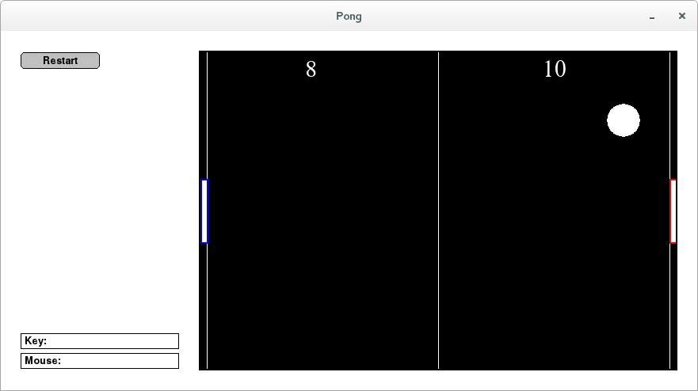

# An Introduction to Interactive Programming in Python (Part 1)

This is some materials from An Introduction to Interactive Programming in Python (Part 1):

https://www.coursera.org/learn/interactive-python-1/home/welcome

After the course, I built a Pong Game project:



## Solution for simplegui


```bash
# On centos 7
sudo yum install pygame
sudo pip install SimpleGUICS2Pygame

# install pygame on virtualenv
yes y |pip install git+http://github.com/xamox/pygame
```

Ref:
1. http://mooc.guokr.com/discussion/1287/
2. https://pypi.python.org/pypi/SimpleGUICS2Pygame/
3. https://bitbucket.org/OPiMedia/simpleguics2pygame
